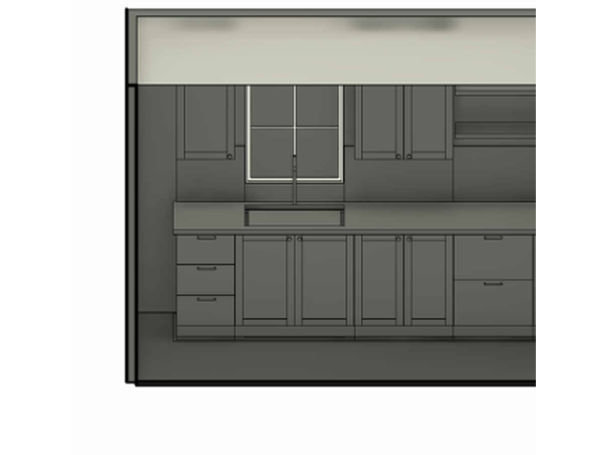
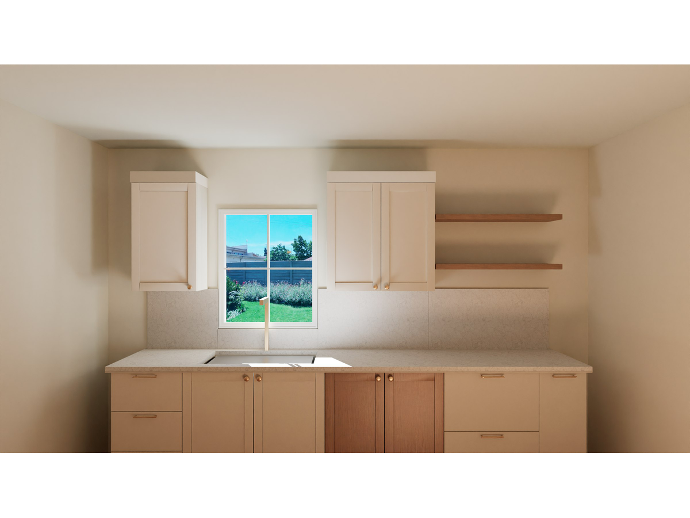
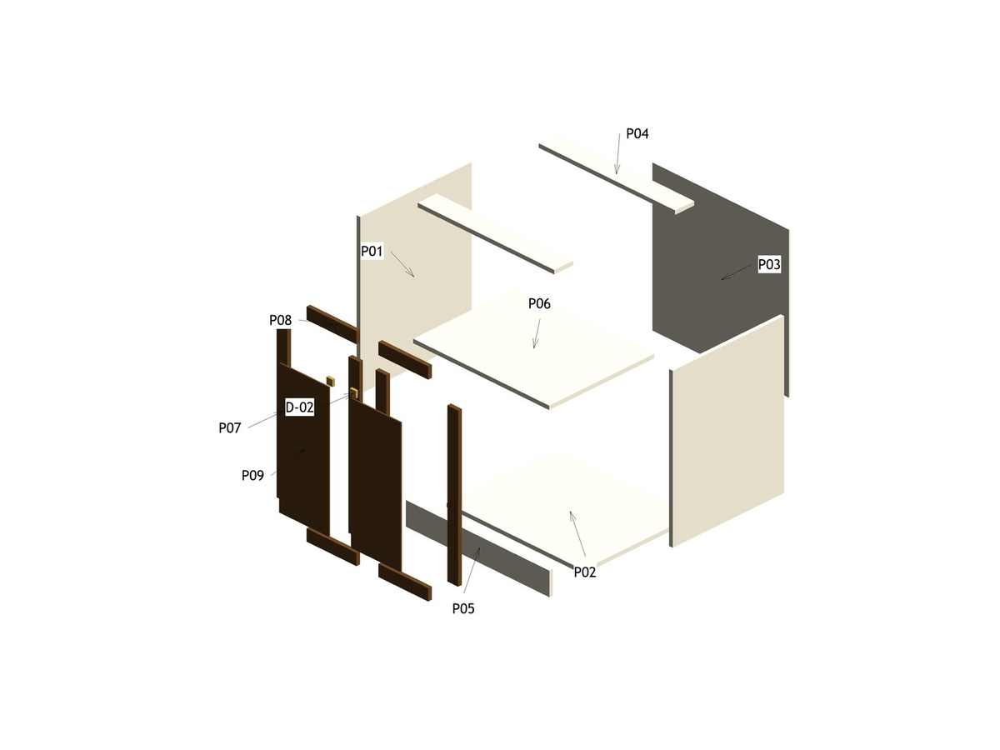
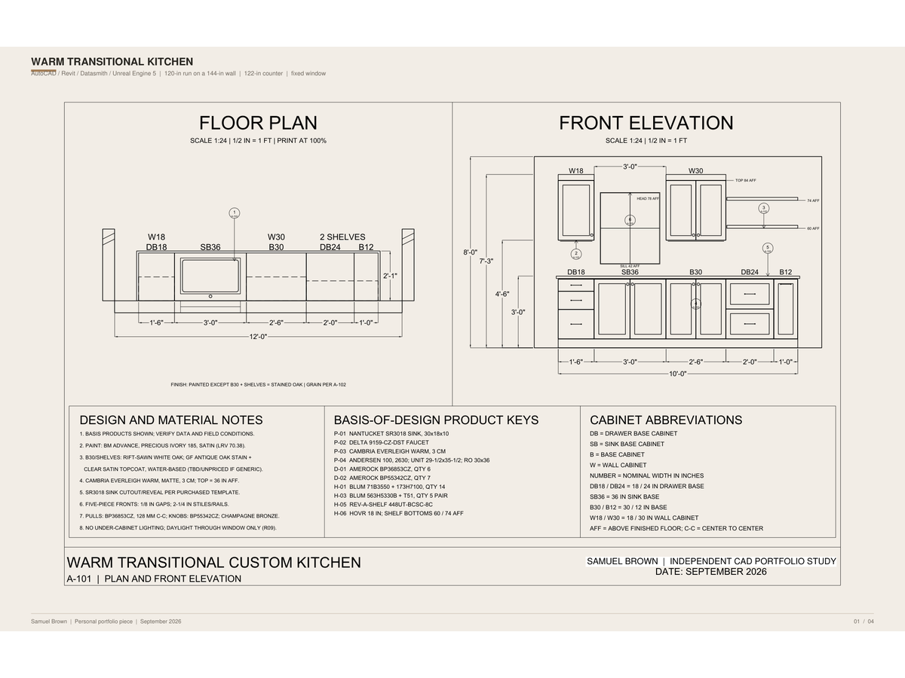
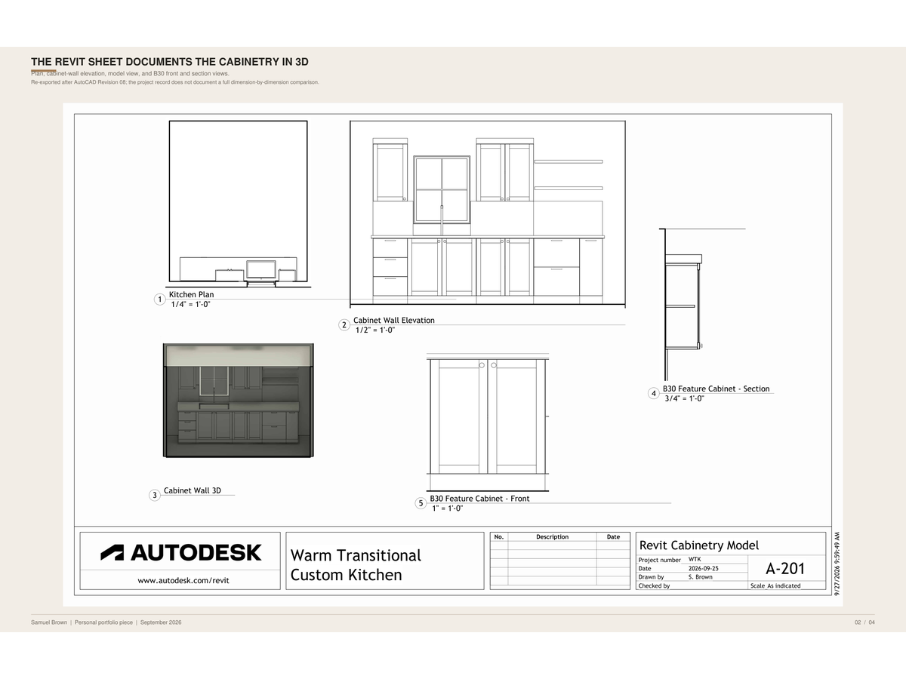
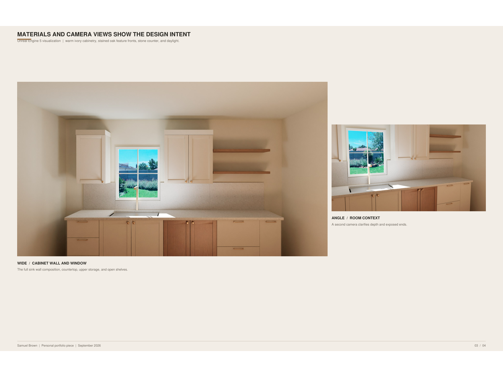
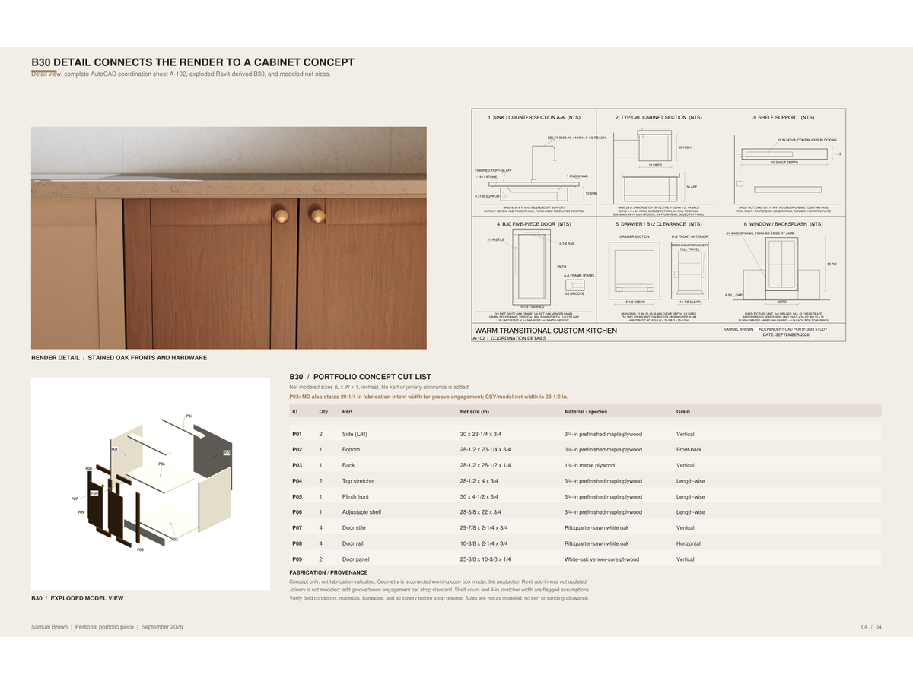
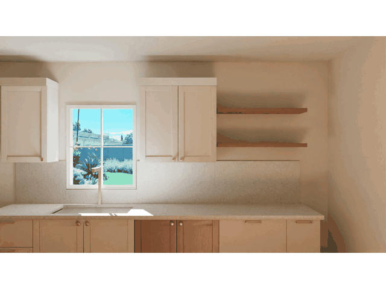

# Warm Transitional Kitchen

This project contains the Unreal Engine kitchen visualization, its supporting source assets, review renders, and portfolio deliverable. The repository contains the project materials and portfolio deliverables.

See the [AutoCAD sheets](CAD_files/WTK_Sheets.dwg), [A-101 drawing](gallery/kitchen-plan-and-front-elevation-a101.pdf), [A-102 drawing](gallery/kitchen-coordination-details-a102.pdf), and [bill of materials](gallery/kitchen-cabinet-bill-of-materials.xlsx) for project context.

## Portfolio gallery

See the [reference board](gallery/kitchen-design-reference-board.svg), [wide final camera render](gallery/kitchen-final-wide-render.png), [detail render](gallery/kitchen-final-cabinet-detail-render.png), and [angle render](gallery/kitchen-final-angle-render.png).

View the [full portfolio PDF](Samuel_Brown_Warm_Transitional_Kitchen_Portfolio.pdf).

<figure>
  
  <figcaption>Cabinet wall in three dimensions, showing the full cabinetry composition.</figcaption>
</figure>

<figure>
  
  <figcaption>Wide kitchen view with the island, cabinetry, and overall room layout.</figcaption>
</figure>

<figure>
  
  <figcaption>Angled view across the island toward the cabinet wall.</figcaption>
</figure>

<figure>
  
  <figcaption>Close view of cabinet materials and hardware.</figcaption>
</figure>

<figure>
  
  <figcaption>Exploded cabinet assembly with components separated for review.</figcaption>
</figure>

  
Original portfolio pages

  <figure>
    
    <figcaption>Original portfolio, page 1.</figcaption>
  </figure>

  <figure>
    
    <figcaption>Original portfolio, page 2.</figcaption>
  </figure>

  <figure>
    
    <figcaption>Original portfolio, page 3.</figcaption>
  </figure>

  <figure>
    
    <figcaption>Original portfolio, page 4.</figcaption>
  </figure>

[View the full resolution MP4](gallery/kitchen-dolly-animation-full.mp4)

`Unreal Engine Assets/WTK/Config/DefaultEngine.ini` is intentionally omitted because it contains a local credential-like `SecurityToken`; recreate the Unreal configuration locally before opening the project. Phase 8 has administrative sign-off. Native application reopen and Detail lineage are recorded; person-hours remain unresolved.
