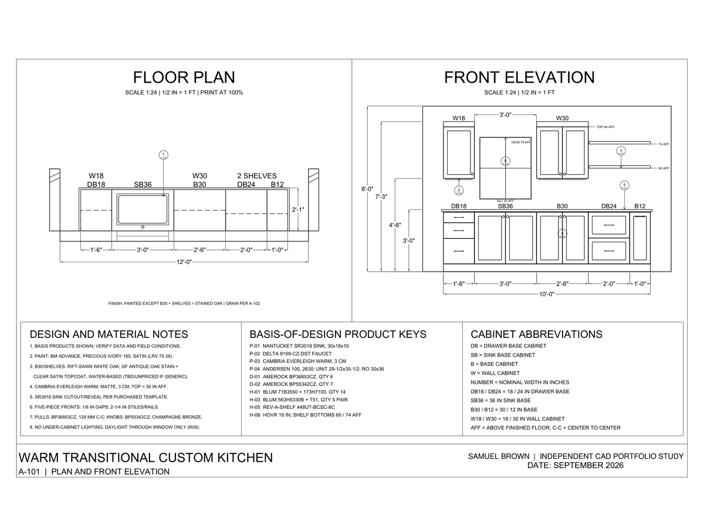
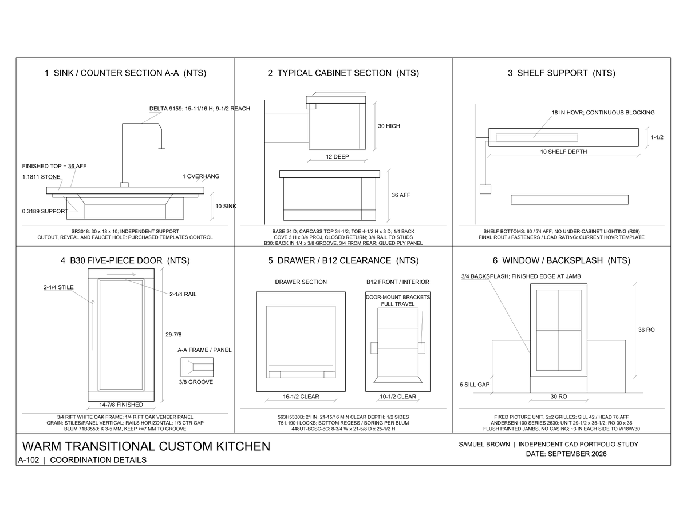
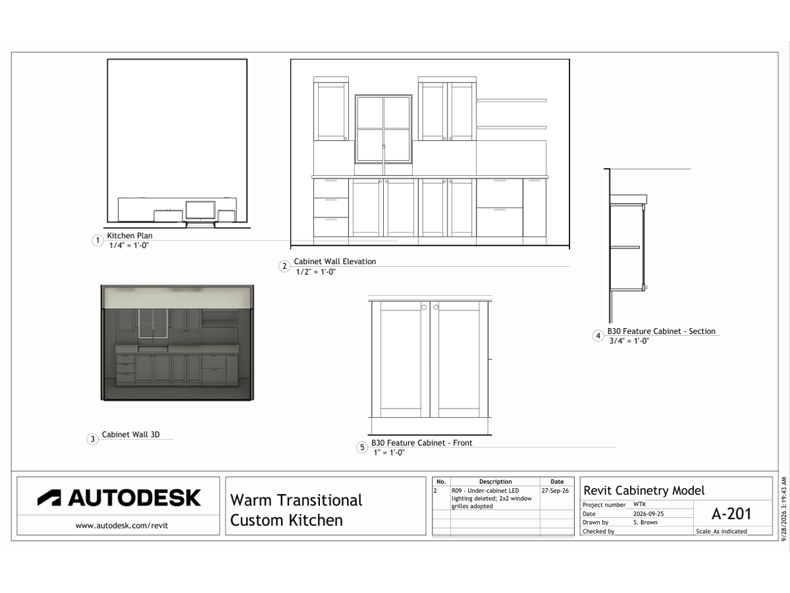
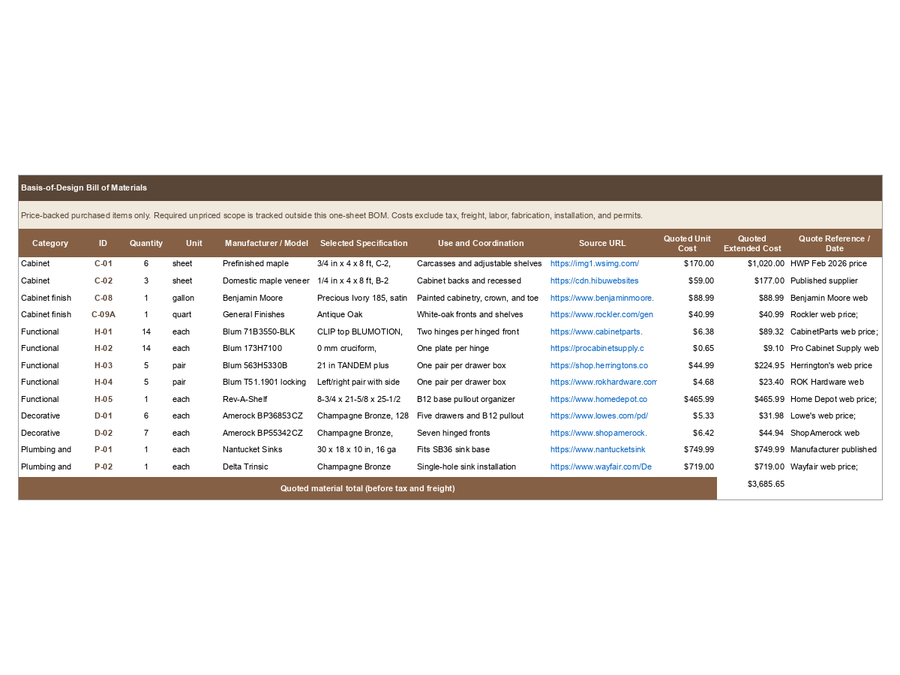
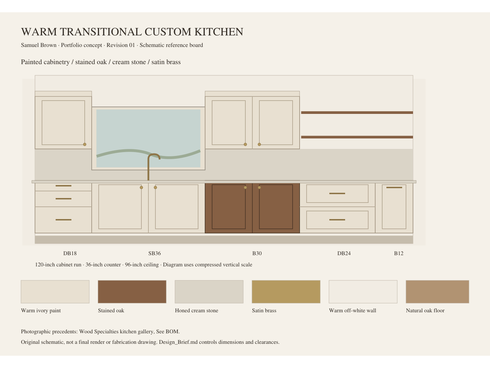
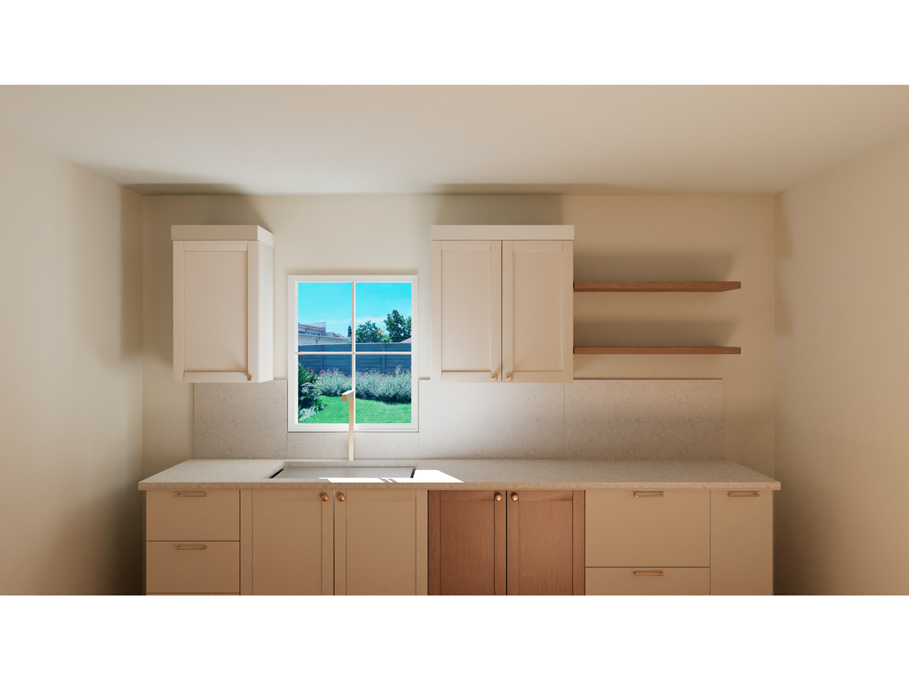
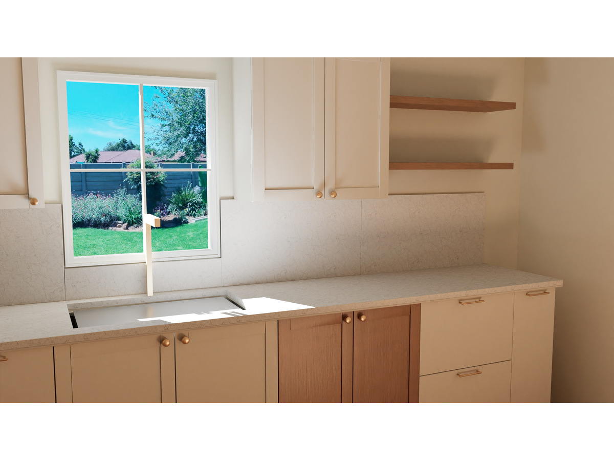
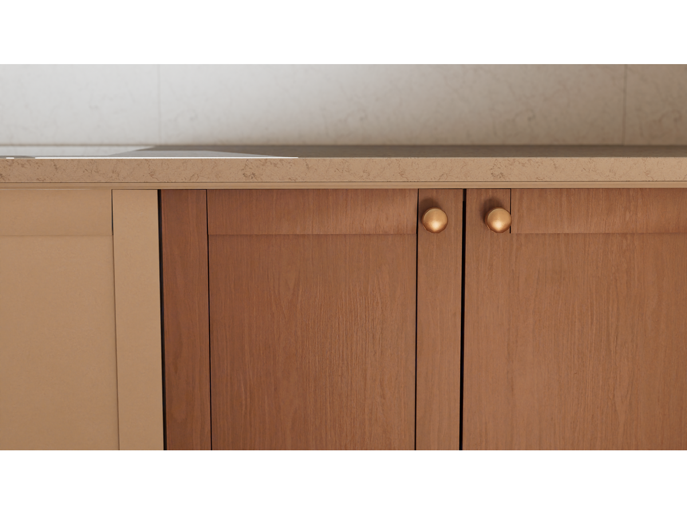

# Warm Transitional Kitchen | CAD/BIM Portfolio Study

Samuel Brown’s personal independent CAD portfolio study documents a warm transitional kitchen as a coordinated drawing and modeling exercise. The cabinet run is 120 inches on a 144-inch wall, with a fixed window and a 122-inch counter. The work uses AutoCAD for the A101 plan/front elevation and A102 coordination details, and Revit for the A201 cabinetry model and B30 feature-cabinet views. It also includes a price-backed purchased-item BOM and a conceptual B30 modeled-size list.

The sheets and supporting model show drafting, cabinet layout, elevations, sections, product coordination, and documentation workflow. A-101 and A-102 carry the AutoCAD drawing set; A-201 presents the Revit plan, cabinet-wall elevation, 3D model view, and B30 details. The supporting material includes an exploded B30 view, BOM, reference board, and final visualization renders. These are portfolio study materials, not issued, fabrication-validated, or construction-ready documents.

The Revit A-201 sheet was re-exported after AutoCAD Revision 08, but the project record documents no full dimension-by-dimension AutoCAD/Revit comparison. Field conditions, clearances, and current product templates require verification before use. BOM pricing covers price-backed purchased items only; tax, freight, labor, fabrication, installation, permits, and unpriced items are excluded, so no quoted subtotal should be read as total project cost.

*12-second dolly animation; select the preview to open the full MP4.*

## Technical Documentation

### A-101 | Plan and Front Elevation

AutoCAD sheet documenting the 120-inch cabinet run, room relationship, front elevation, key dimensions, design notes, and basis-of-design products. The drawing notes direct verification against field conditions and current product information.

### A-102 | Coordination Details

AutoCAD detail sheet covering sink/counter coordination, typical cabinet section, shelf support, B30 five-piece door, drawer/B12 clearance, and window/back-splash relationship. Cutouts, hardware settings, fasteners, and templates remain subject to current product data and field verification.

### A-201 | Revit Cabinetry Model

Revit documentation of the cabinetry model with plan, cabinet-wall elevation, 3D view, and B30 front/section. The sheet was re-exported after AutoCAD Revision 08; the project record does not document a full dimension-by-dimension comparison between the AutoCAD and Revit sets.

## Model, Scope, and References

### Cabinet Wall | Revit 3D View

Original Revit 3D view, shown at its native 333 × 326 pixels.

### Purchased-Item Bill of Materials

The workbook covers price-backed purchased items and tracks required unpriced scope separately. Its price basis excludes tax, freight, labor, fabrication, installation, permits, and unpriced items. Any workbook subtotal applies only to its stated priced scope; it is not a total project cost.

### B30 | Exploded Cabinet and Concept Cut-List Context

The portfolio PDF, page 4, provides the B30 study cut-list context: net modeled sizes with no kerf or joinery allowance, and explicit notes that the concept is not fabrication-validated. Field conditions, material choices, joinery, shelf count, assumptions, and shop requirements need review before any shop release. [Open the portfolio PDF](Samuel_Brown_Warm_Transitional_Kitchen_Portfolio.pdf).

### Reference Board

Original schematic reference board for the study’s layout and material direction. Its photographic precedents are credited on the board to the Wood Specialties kitchen gallery; the board is a schematic, not a final render or fabrication drawing.

## Final Unreal Engine Renders

## File Index

- [A-101 plan and front elevation (PDF)](gallery/kitchen-plan-and-front-elevation-a101.pdf)
- [A-102 coordination details (PDF)](gallery/kitchen-coordination-details-a102.pdf)
- [A-201 Revit cabinetry sheet (PDF)](gallery/WTK_A-201.pdf)
- [Cabinet bill of materials (XLSX)](gallery/kitchen-cabinet-bill-of-materials.xlsx)
- [AutoCAD sheets drawing (DWG)](CAD_files/WTK_Sheets.dwg)
- [Revit-linked plan drawing (DWG)](CAD_files/WTK_Revit_Link_Plan.dwg)
- [Revit-linked elevation drawing (DWG)](CAD_files/WTK_Revit_Link_Elevation.dwg)
- [WTK_Start.rvt — STARTER file](CAD_files/WTK_Start.rvt)
- [Samuel Brown Warm Transitional Kitchen portfolio (PDF)](Samuel_Brown_Warm_Transitional_Kitchen_Portfolio.pdf)